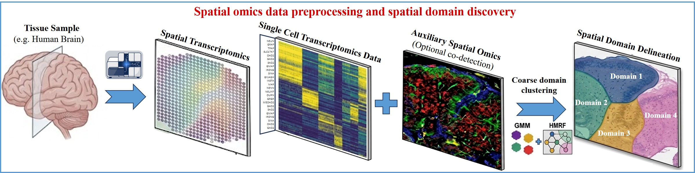
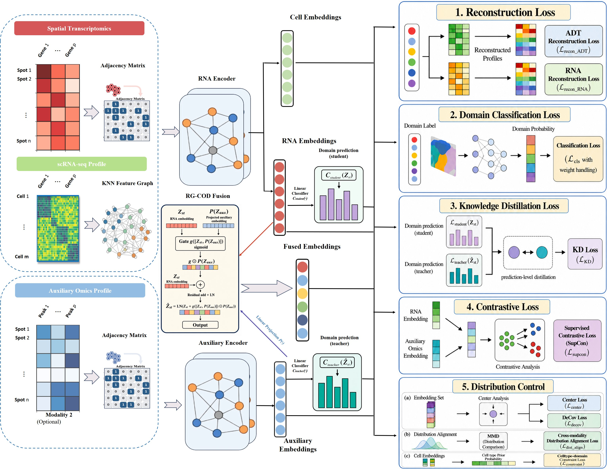
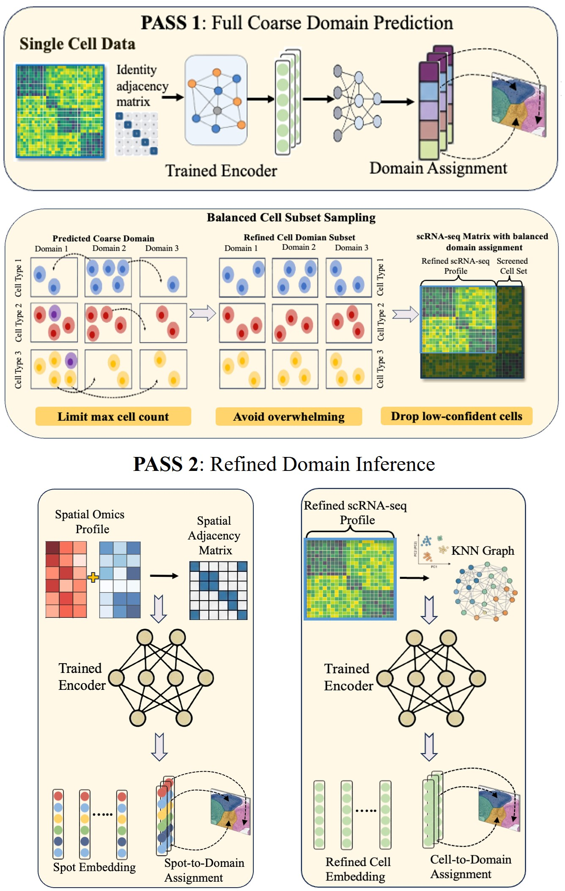
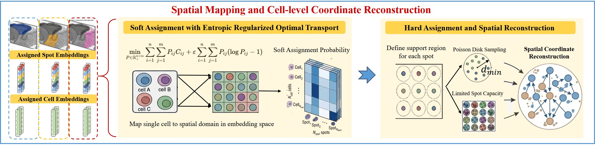
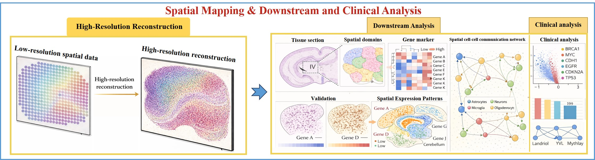

# COMPASS

**Cross-omics Mapping for Precise Assembly of Spatial Single-cell atlases (COMPASS)** reconstructs cell-resolved spatial maps by integrating spot-level spatial omics with dissociated single-cell RNA-seq, optionally using a co-registered auxiliary spatial modality (for example chromatin accessibility) to sharpen cross-modal alignment. The method learns a shared latent representation, performs domain-aware cell-to-spot assignment via regularized optimal transport with discrete refinement, and refines sub-spot coordinates so mapped cells form a dense, minimally overlapping layout suitable for spatial analysis at single-cell resolution.

This repository contains a script-oriented Python implementation used alongside the simulation notebooks, together with utilities for visualization and mapping.


## Workflow overview

The peer-reviewed manuscript describes COMPASS in three coupled parts—(i) domain-aware representation (RG-COD), (ii) domain-constrained mapping (entropy-regularized optimal transport with capacity-limited hard assignment), and (iii) geometric refinement (Poisson-disk Geometric Refinement, PDGR)—linked by the workflow below (manuscript Fig. 1).

### 1. Spatial omics preprocessing and domain discovery

Spatial transcriptomics, dissociated scRNA-seq, and optional co-registered auxiliary spatial omics are preprocessed; coarse spatial domains are inferred under GMM or HMRF priors to anchor downstream learning.

<p align="center">
  
</p>

*Figure 1. Spatial omics preprocessing and coarse domain delineation (GMM / HMRF).*

The minimal `COMPASS_run.py` path expects **precomputed spot-level domain labels** on the spatial RNA object (`obs['domain']` or `obs['gt']`). HMRF-based domain initialization as in the manuscript is implemented in the `Scenario1`–`Scenario4` notebooks, not in the default script.

### 2. Domain-aware multimodal representation (RG-COD)

Multi-modal graph encoders and Residual-Gated Cross-Omics Distillation (RG-COD) align spatial spots and dissociated cells in a shared RNA-centered latent space while selectively transferring auxiliary spatial omics information into the deployable RNA backbone. Implemented in [`COMPASS/COMPASS_core.py`](COMPASS/COMPASS_core.py) via `train_multimodal_and_predict_sc`.

<p align="center">
  
</p>

*Figure 2. Domain-aware representation module: RNA and auxiliary encoders, RG-COD fusion, and multi-objective training losses.*

### 3. Two-pass domain inference

After training, a first pass assigns coarse domains to dissociated cells; balanced subsampling limits dominant cell types and drops low-confidence cells. A second pass refines spot and cell embeddings and domain assignments for spatial omics and the filtered scRNA-seq reference.

<p align="center">
  
</p>

*Figure 3. Two-pass domain inference with balanced single-cell subsampling.*

Outputs are written to `sc_adata.obs['pred_domain']`, `sc_adata.obsm['pred_domain_proba']`, and spot-level embeddings in `adata_prep.obsm['gae_latent']` (see [Input data](#input-data-anndata) below).

### 4. Spatial mapping and coordinate reconstruction (OT + PDGR)

Cells and spots are stratified by predicted domain and cell type; entropy-regularized optimal transport yields soft cell-to-spot assignments within compatible strata, followed by capacity-constrained hard assignment. Poisson-disk Geometric Refinement (PDGR) then assigns continuous sub-spot coordinates under per-spot capacity, minimum separation, and type-coherent neighborhood constraints. Implemented in [`COMPASS/COMPASS_method.py`](COMPASS/COMPASS_method.py) and orchestrated by `run_four_figure_pipeline` in [`COMPASS/COMPASS_run.py`](COMPASS/COMPASS_run.py).

<p align="center">
  
</p>

*Figure 4. Entropy-regularized optimal transport, hard assignment, and Poisson-disk geometric refinement (PDGR).*

### 5. Downstream and clinical analysis

COMPASS reconstructs a high-resolution spatial single-cell atlas that supports marker visualization, spatial domain characterization, cell–cell communication analysis, and clinical cohort studies.

<p align="center">
  
</p>

*Figure 5. High-resolution spatial single-cell atlas and downstream / clinical analyses enabled by COMPASS.*

This panel is illustrative of manuscript Results; full reproduction of benchmarks and real-data analyses is provided in the `Scenario1`–`Scenario4` notebooks and the paper, not by the four diagnostic figures from `python COMPASS_run.py`.

## Relationship between this repository and the manuscript

Steps 1 and 5 in the workflow above are covered in the manuscript and notebooks but are not fully automated in the minimal `COMPASS_run.py` path. The paper additionally reports hidden Markov random field (HMRF)–based tissue domain initialization and full benchmark protocols across simulations and real datasets. In this repository, the graph autoencoder training path in `COMPASS/COMPASS_core.py` is a **minimal, script-friendly** port derived from the Scenario 4 multimodal notebook. It expects **spatial domain labels** on the spot-level RNA object (for example in `adata.obs['gt']`, which the driver copies to `domain` when needed), which matches the bundled simulation-style workflow. For full parity with every analysis in the manuscript, use the scenario notebooks under `Scenario1`–`Scenario4` or extend `run_compass_model` in `COMPASS_run.py` as noted in that file’s docstring.

## Repository layout

| Path | Description |
|------|-------------|
| `COMPASS/` | Python modules: data loading (`COMPASS_data.py`), model training and embedding inference (`COMPASS_core.py`), optimal transport, assignment, refinement, and plotting (`COMPASS_method.py`), and the entry script `COMPASS_run.py`. |
| `Scenario1/` … `Scenario4/` | Jupyter notebooks for single-omic and multi-omic analyses across the four simulation designs described in the paper. |
| `data_gen/` | Scripts for generating synthetic spatial and reference data used in simulations. |

## Requirements

- Python 3.10 or newer is recommended (compatible with current `scanpy` / `anndata` stacks).
- Core packages: `numpy`, `pandas`, `anndata`, `scanpy`, `scikit-learn`, `scipy`, `matplotlib`, `torch`.

PyTorch may use CUDA if available; the optimal-transport routines in `COMPASS_method.py` will select CUDA when present. CPU execution is supported but slower for large tensors.

Install dependencies with your preferred environment manager, for example:

```bash
python -m venv .venv
# Windows: .venv\Scripts\activate
# Linux / macOS: source .venv/bin/activate
pip install numpy pandas anndata scanpy scikit-learn scipy matplotlib torch
```

Adjust package versions to match your institutional or cluster policy.

## Input data (`AnnData`)

`COMPASS_data.load_and_preprocess` reads three HDF5-backed AnnData objects (`.h5ad`).

**General constraints**

- **Gene names** must be unique and overlap between spatial RNA and single-cell RNA (non-empty intersection), or loading raises an error.
- **Spot identifiers** (`obs_names`) must match between spatial RNA and the second spatial modality (non-empty intersection), and must be **unique** on spatial objects.

**Single-cell reference (`sc_adata`)**

- Cell type column: one of `CellType`, `cell_type`, or `cellType` (normalized internally to `CellType`).

**Spatial RNA (`adata`, spot-level)**

- `obsm['spatial']`: two-dimensional coordinates (used by the graph autoencoder and downstream figures).
- Domain supervision for training: `obs['domain']`, or ground-truth / pseudo-labels in `obs['gt']` (the driver maps `gt` to `domain` when `domain` is absent).

**Second modality on spots (`adt_adata`, for example ATAC)**

- Same spots as spatial RNA (aligned `obs_names`). Feature matrix is treated according to `mod2_kind` in `train_multimodal_and_predict_sc` (default `"atac"` in `COMPASS_run.py`).

**After `run_compass_model` (or equivalent precomputation)**

The figure pipeline expects, at minimum:

| Object | Field | Role |
|--------|--------|------|
| `sc_adata` | `obsm['gae_latent']` | Shared latent embedding |
| `sc_adata` | `obsm['pred_domain_proba']` | Domain probability matrix |
| `sc_adata` | `obs['pred_domain']` | Predicted domain labels |
| `sc_adata` | `obs['CellType']` | Cell types |
| `adata_prep` (ST) | `obsm['gae_latent']` | Spot latent embedding |
| `adata_prep` | `obsm['spatial']` | Spatial coordinates |
| `adata_prep` | `obs['domain']` | Domain labels for OT stratification |

If `compass_outputs_ready` is true, `run_compass_model(..., skip_if_ready=True)` skips training (useful for precomputed `.h5ad` files).

## Running the default pipeline

Default filenames are resolved relative to the `COMPASS/` directory (next to `COMPASS_run.py`): `ref_RNA.h5ad`, `simulation_rna_drop.h5ad`, `simulation_atac.h5ad`.

```bash
cd COMPASS
python COMPASS_run.py
```

The default script implements workflow steps 2–4 (representation, inference, OT + PDGR) and produces four diagnostic figures. It loads data, sets the global seed via `load_and_preprocess(..., run_seed=123)`, runs the multimodal model when outputs are not already present, then executes `run_four_figure_pipeline`: PCA of the GAE latent (cells filtered by maximum domain probability), stacked bar chart of cell types by predicted domain, spot-level composition pies after soft assignment, and cell-level spatial scatter after geometric refinement.

`main()` in `COMPASS_run.py` currently accepts optional `Path` arguments in code but the `if __name__ == "__main__"` block invokes `main()` without command-line arguments. To use custom paths, import `main` from another module or edit the call, for example:

```python
from pathlib import Path
from COMPASS_run import main
main(Path("my_sc.h5ad"), Path("my_st_rna.h5ad"), Path("my_st_atac.h5ad"))
```

(Run with the `COMPASS` package directory on `PYTHONPATH`, or execute from within that directory.)

## Reproducibility

- `load_and_preprocess(..., run_seed=123)` invokes `set_global_seed` with deterministic PyTorch behavior where supported.
- Several steps fix random seeds in code (for example `PCA(..., random_state=0)` in `COMPASS_run.py`, Poisson-disk–style refinement with `seed=0`, and `pca_random_state=0` in `train_multimodal_and_predict_sc`). Slight numerical differences may still appear across hardware and library versions.

## License

No `LICENSE` file is included in this repository. Redistribution and reuse terms should be obtained from the authors or added here when decided.


<!-- ## Authors
Xuanwu Wang<sup>1,2#</sup>, Wenjun Fang<sup>1#</sup>, Yuqi Wang<sup>3#</sup>, Xingbo Guan<sup>2#</sup>, Nuo Li<sup>2</sup>, Yihao Bai<sup>4</sup>, Lixin Liang<sup>1</sup>, Heng Peng<sup>2</sup>, Wei Liu<sup>4*</sup>, Qishi Dong<sup>1*</sup>

Affiliations: <sup>1</sup>School of Artificial Intelligence, Shenzhen Technology University, Shenzhen 518118, China; <sup>2</sup>Department of Mathematics, Hong Kong Baptist University, Hong Kong; <sup>3</sup>Department of Statistics and Data Science, Beijing Normal–Hong Kong Baptist University, Zhuhai 519087, China; <sup>4</sup>School of Mathematics, Sichuan University, Chengdu 610065, China. -->


## Contact

For questions about the method or this code release, please contact the corresponding authors: Wei Liu ([liuwei8@scu.edu.cn](mailto:liuwei8@scu.edu.cn)), or Qishi Dong ([dongqishi@sztu.edu.cn](mailto:dongqishi@sztu.edu.cn)).
